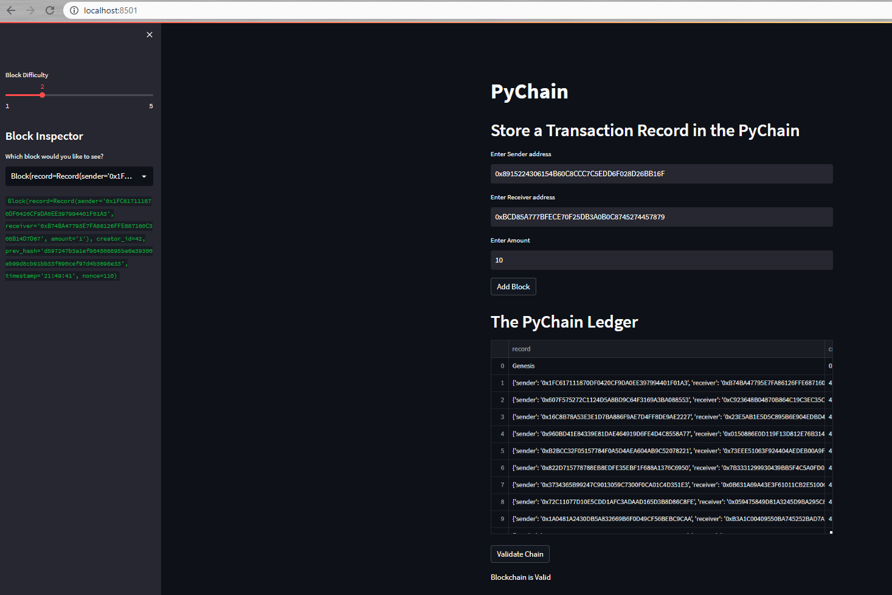

# PyChain Ledger

You’re a fintech engineer who’s working at one of the five largest banks in the world. You were recently promoted to act as the lead developer on their decentralized finance team. Your task is to build a blockchain-based ledger system, complete with a user-friendly web interface. This ledger should allow partner banks to conduct financial transactions (that is, to transfer money between senders and receivers) and to verify the integrity of the data in the ledger.

You’ll make the following updates to the provided Python file for this assignment, which already contains the basic `PyChain` ledger structure that you created throughout the module:

1. Create a new data class named `Record`. This class will serve as the blueprint for the financial transaction records that the blocks of the ledger will store.

2. Modify the existing `Block` data class to store `Record` data.

3. Add Relevant User Inputs to the Streamlit interface.

4. Test the PyChain Ledger by Storing Records.

---

## Run Locally

> streamlit run pychain.py

---
## Streamlit PyChain Application Screenshot

* This Streamlit Application mimics a blockchain-based ledger system that allows users to conduct financial transactions (transfer money between senders and receivers) and to verify the integrity of the data in the ledger.

  * To use the application, the user is prompted to enter a Sender address, Receiver address, and the Amount of crypto to send. The "PyChain Ledger" tracks and stores the transactions and the user is able to inspect each block/transaction using the "Block Inspector" drop-down menu located to the left of the application. The user is also able to evaluate the Blockchain Ledger System by clicking the "Validate Chain" button, which compares the hash of the previous block to the previous hash of the current block.

---

© 2021 Trilogy Education Services, a 2U, Inc. brand. All Rights Reserved.
